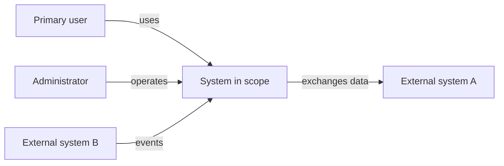
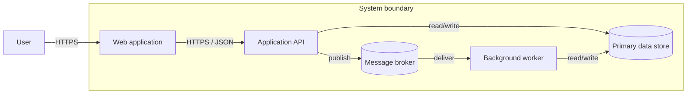
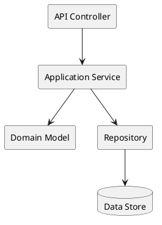
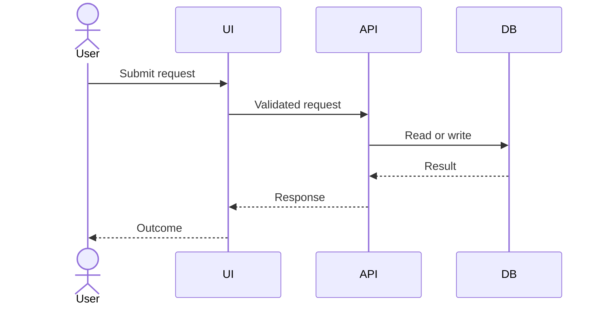
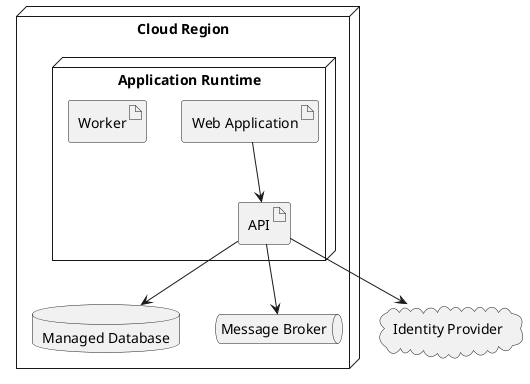
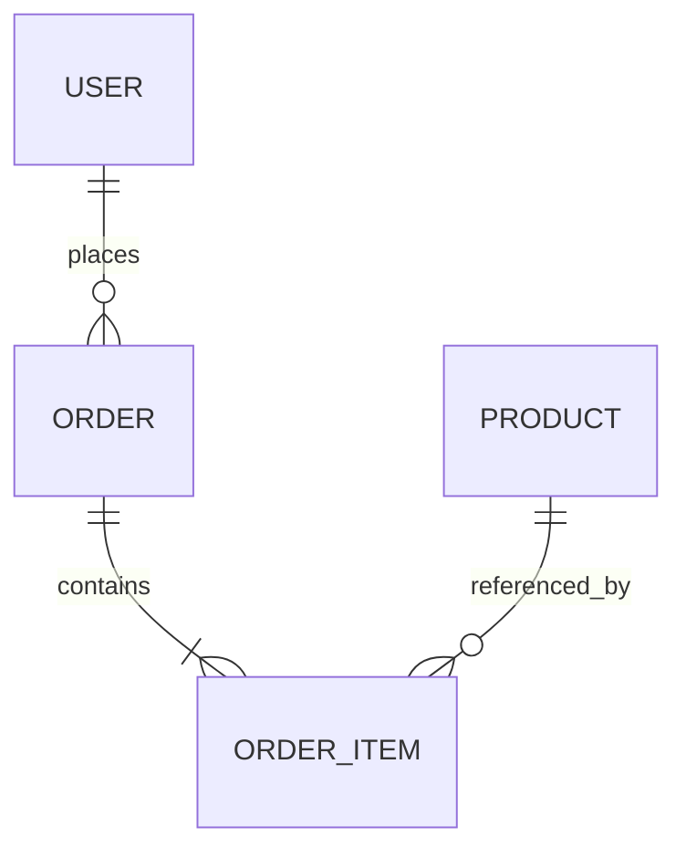
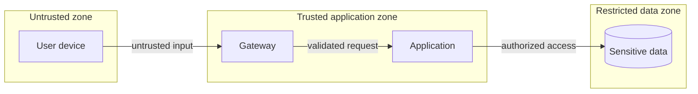

# System Architecture Document Template

> Use this document to explain the architecture, the decisions behind it, and how the system satisfies its functional and quality requirements. The structure is inspired by arc42, complemented with C4 views, architecture decision records, threat modeling, and operational readiness.

## 0. Document Control

| Field | Value |
|---|---|
| System | `<name>` |
| Architecture owner | `<name and role>` |
| Status | `Draft / In review / Approved / Superseded` |
| Version | `<x.y>` |
| Last updated | `<YYYY-MM-DD>` |
| Reviewers / approvers | `<names and roles>` |
| Product brief | `<link>` |
| Feature specifications | `<links>` |
| ADR repository | `<link>` |

### Revision History

| Version | Date | Author | Change | Approval |
|---|---|---|---|---|
| 0.1 | `<date>` | `<author>` | Initial draft | `<status>` |

## 1. Introduction and Goals

### 1.1 Purpose

`<State what this architecture document covers and the decisions it is intended to support.>`

### 1.2 System Overview

`<Briefly describe the system, its users, business purpose, and major capabilities.>`

### 1.3 Architecture Goals

| ID | Goal | Rationale | Evidence / measure | Priority |
|---|---|---|---|---|
| AG-001 | `<goal>` | `<business or technical driver>` | `<measure>` | `<priority>` |

### 1.4 Key Requirements

| Requirement ID | Summary | Architectural significance | Link |
|---|---|---|---|
| `<FR/NFR ID>` | `<summary>` | `<why it shapes architecture>` | `<source>` |

### 1.5 Stakeholders

| Stakeholder / role | Concern | View or evidence needed |
|---|---|---|
| `<role>` | `<concern>` | `<diagram, metric, decision, assurance>` |

## 2. Constraints

| ID | Category | Constraint | Source | Architectural consequence |
|---|---|---|---|---|
| CON-001 | `Technical / Organizational / Legal / Financial / Schedule` | `<constraint>` | `<source>` | `<consequence>` |

## 3. Context and Scope

### 3.1 Business Context



### 3.2 Technical Context

| External interface | Direction | Protocol / format | Authentication | Data classification | Availability expectation | Owner |
|---|---|---|---|---|---|---|
| `<system / user>` | `Inbound / Outbound / Both` | `<HTTPS, event, file, etc.>` | `<method>` | `<class>` | `<target>` | `<owner>` |

### 3.3 Scope Boundary

- **Inside the system:** `<components and responsibilities>`
- **Outside the system:** `<external responsibilities>`
- **Shared responsibility:** `<items needing explicit ownership>`

## 4. Solution Strategy

### 4.1 Strategy Summary

`<Summarize the fundamental approach, architecture style, decomposition strategy, integration style, data strategy, security strategy, and deployment model.>`

### 4.2 Key Technology Choices

| Concern | Choice | Why | Alternatives considered | ADR |
|---|---|---|---|---|
| `<concern>` | `<choice>` | `<drivers and trade-offs>` | `<alternatives>` | `<ADR link>` |

### 4.3 Architecture Principles

1. `<principle and implication>`
2. `<principle and implication>`
3. `<principle and implication>`

## 5. Building Block View

### 5.1 C4 Container View



### 5.2 Building Block Catalog

| ID | Building block | Type | Responsibility | Interfaces | Data owned | Technology | Owner |
|---|---|---|---|---|---|---|---|
| BB-001 | `<name>` | `Application / Service / Component / Data store` | `<responsibility>` | `<interfaces>` | `<data>` | `<technology>` | `<team>` |

### 5.3 Component View for `<Container>`



### 5.4 Interface Contracts

| Interface ID | Provider | Consumer | Contract / schema | Versioning | Idempotency | Error model | SLO |
|---|---|---|---|---|---|---|---|
| INT-001 | `<provider>` | `<consumer>` | `<OpenAPI / AsyncAPI / schema link>` | `<strategy>` | `<rules>` | `<codes / retries>` | `<target>` |

## 6. Runtime View

Document architecturally significant scenarios, including normal, failure, recovery, and administrative flows.

### 6.1 Scenario: `<Name>`

- **Trigger:** `<trigger>`
- **Preconditions:** `<preconditions>`
- **Expected outcome:** `<outcome>`
- **Related requirements:** `<IDs>`



### 6.2 Failure and Recovery Behavior

| Failure | Detection | User / system behavior | Retry / timeout | Recovery | Data consistency |
|---|---|---|---|---|---|
| `<failure>` | `<signal>` | `<behavior>` | `<policy>` | `<procedure>` | `<guarantee>` |

## 7. Deployment View

### 7.1 Deployment Diagram



### 7.2 Environments

| Environment | Purpose | Data policy | Scale | Access | Deployment trigger | Differences from production |
|---|---|---|---|---|---|---|
| Development | `<purpose>` | `<synthetic / masked>` | `<scale>` | `<access>` | `<trigger>` | `<differences>` |
| Test | `<purpose>` | `<policy>` | `<scale>` | `<access>` | `<trigger>` | `<differences>` |
| Production | `<purpose>` | `<policy>` | `<scale>` | `<access>` | `<trigger>` | `N/A` |

### 7.3 Infrastructure and Network

| Resource | Service / technology | Network zone | Ingress | Egress | Encryption | Backup / recovery |
|---|---|---|---|---|---|---|
| `<resource>` | `<service>` | `<zone>` | `<rules>` | `<rules>` | `<at rest / in transit>` | `<policy>` |

### 7.4 Capacity and Scaling

| Workload | Expected load | Peak profile | Scaling signal | Limit / quota | Load-test evidence |
|---|---|---|---|---|---|
| `<workload>` | `<value>` | `<profile>` | `<metric>` | `<limit>` | `<link>` |

## 8. Data Architecture

### 8.1 Data Model



### 8.2 Data Ownership and Lifecycle

| Data entity | System of record | Owner | Classification | Residency | Retention | Deletion | Backup |
|---|---|---|---|---|---|---|---|
| `<entity>` | `<system>` | `<owner>` | `<class>` | `<location>` | `<policy>` | `<method>` | `<method>` |

### 8.3 Consistency, Transactions, and Caching

- **Consistency model:** `<strong / eventual / bounded staleness>`
- **Transaction boundaries:** `<description>`
- **Concurrency control:** `<approach>`
- **Cache strategy:** `<keys, invalidation, TTL, failure behavior>`
- **Migration and schema evolution:** `<approach>`

## 9. Cross-Cutting Concepts

### 9.1 Identity and Access

| Actor / workload | Authentication | Authorization | Credential lifecycle | Audit evidence |
|---|---|---|---|---|
| `<actor>` | `<method>` | `<RBAC / ABAC / policy>` | `<rotation / revocation>` | `<logs>` |

### 9.2 Security Architecture

- **Trust boundaries:** `<description and diagram link>`
- **Secrets management:** `<approach>`
- **Cryptography:** `<approved standards / key handling>`
- **Input validation and output encoding:** `<approach>`
- **Dependency and supply-chain controls:** `<approach>`
- **Security logging and incident support:** `<approach>`

### 9.3 Threat Model

| ID | Asset / flow | Threat | Existing control | Residual risk | Action | Owner |
|---|---|---|---|---|---|---|
| TM-001 | `<asset>` | `<STRIDE or other threat>` | `<control>` | `<rating>` | `<action>` | `<owner>` |



### 9.4 Privacy

- Data minimization: `<approach>`
- Purpose limitation: `<approach>`
- Consent or legal basis: `<reference if applicable>`
- Data subject / user controls: `<access, correction, deletion, export>`
- Logging redaction: `<approach>`

### 9.5 Observability

| Signal | What is captured | Correlation | Retention | Alert / dashboard | Owner |
|---|---|---|---|---|---|
| Logs | `<events>` | `<trace / request ID>` | `<policy>` | `<link>` | `<owner>` |
| Metrics | `<SLIs>` | `<dimensions>` | `<policy>` | `<link>` | `<owner>` |
| Traces | `<boundaries>` | `<trace ID>` | `<policy>` | `<link>` | `<owner>` |

### 9.6 Resilience

| Dependency / failure mode | Timeout | Retry | Circuit breaker | Fallback | Recovery objective | Test |
|---|---|---|---|---|---|---|
| `<dependency>` | `<value>` | `<policy>` | `<policy>` | `<behavior>` | `<RTO/RPO or SLO>` | `<test>` |

### 9.7 Configuration, Feature Flags, and Secrets

| Item | Storage | Scope | Change process | Validation | Rollback |
|---|---|---|---|---|---|
| `<configuration>` | `<store>` | `<environment / tenant>` | `<process>` | `<check>` | `<method>` |

### 9.8 Internationalization and Accessibility

- Supported locales: `<locales>`
- Time zone and date handling: `<approach>`
- Character encoding: `<approach>`
- Accessibility target: `<WCAG version and level>`
- Assistive technology test matrix: `<link>`

## 10. Quality Requirements and Scenarios

| ID | Attribute | Source | Stimulus | Environment | Response | Measure | Verification |
|---|---|---|---|---|---|---|---|
| QS-001 | `<performance / availability / security / maintainability>` | `<actor>` | `<event>` | `<condition>` | `<expected behavior>` | `<threshold>` | `<test>` |

## 11. Architecture Decisions

Create a separate ADR for consequential choices and link it here.

| ADR | Decision | Status | Drivers | Consequences | Link |
|---|---|---|---|---|---|
| ADR-001 | `<decision>` | `Proposed / Accepted / Superseded / Rejected` | `<drivers>` | `<positive and negative consequences>` | `<link>` |

### ADR Mini-Template

```markdown
# ADR-XXX: <Decision title>

- Status: Proposed
- Date: YYYY-MM-DD
- Decision owners: <roles>

## Context
<Forces, constraints, and problem.>

## Decision
<Decision in clear terms.>

## Options Considered
1. <Option and trade-offs>
2. <Option and trade-offs>

## Consequences
### Positive
- <consequence>
### Negative
- <consequence>
### Follow-up
- <action or validation>
```

## 12. Risks and Technical Debt

| ID | Risk / debt | Probability | Impact | Evidence | Mitigation | Trigger | Owner |
|---|---|---|---|---|---|---|---|
| AR-001 | `<risk>` | `<rating>` | `<rating>` | `<evidence>` | `<mitigation>` | `<trigger>` | `<owner>` |

## 13. Delivery and Operations

### 13.1 Build and Release

- Source repositories: `<links>`
- Branching / integration strategy: `<strategy>`
- CI quality gates: `<tests, scans, approvals>`
- Artifact integrity and provenance: `<approach>`
- Deployment strategy: `<rolling / blue-green / canary>`
- Rollback strategy: `<approach>`

### 13.2 Operational Model

| Concern | Definition |
|---|---|
| Service owner | `<team / role>` |
| Support model | `<hours, tiers, escalation>` |
| SLOs and error budget | `<targets / link>` |
| Runbooks | `<links>` |
| Incident response | `<process link>` |
| Backup restore test | `<frequency / evidence>` |
| Disaster recovery exercise | `<frequency / evidence>` |

### 13.3 Cost Model

| Cost driver | Assumption | Measurement | Threshold / budget | Optimization action |
|---|---|---|---|---|
| `<driver>` | `<assumption>` | `<metric>` | `<target>` | `<action>` |

## 14. Verification and Architecture Fitness

| Architectural requirement | Verification method | Automated? | Environment | Evidence | Owner |
|---|---|---|---|---|---|
| `<requirement ID>` | `<test, review, simulation, inspection>` | `Yes / No` | `<environment>` | `<link>` | `<owner>` |

## 15. Traceability

| Product goal | Requirement | Architecture element | ADR | Test / operational evidence |
|---|---|---|---|---|
| `<goal>` | `<FR/NFR>` | `<BB / interface / deployment>` | `<ADR>` | `<evidence>` |

## 16. Open Questions

| ID | Question | Decision needed by | Options | Owner | Status |
|---|---|---|---|---|---|
| AQ-001 | `<question>` | `<milestone>` | `<options>` | `<owner>` | `Open / Resolved` |

## 17. Architecture Review Checklist

- [ ] System boundary, users, and external dependencies are clear.
- [ ] Significant requirements and constraints are traceable.
- [ ] Context, container, runtime, deployment, and data views are consistent.
- [ ] Every building block has a clear responsibility and owner.
- [ ] Interfaces define protocol, contract, versioning, errors, and SLOs.
- [ ] Security, privacy, accessibility, and threat modeling are addressed.
- [ ] Quality goals have measurable scenarios and verification plans.
- [ ] Failure modes, recovery, observability, and operational ownership are defined.
- [ ] Important trade-offs are captured in ADRs.
- [ ] Risks, technical debt, cost drivers, and open questions have owners.
- [ ] Diagrams are stored as source-controlled DSL where practical.

## 18. References

### Primary references

- arc42, architecture documentation and communication template: https://arc42.org/
- arc42 section guidance: https://docs.arc42.org/home/
- C4 model, hierarchical architecture abstractions and diagrams: https://c4model.com/
- ISO/IEC/IEEE 29148:2018, requirements engineering: https://www.iso.org/standard/72089.html
- NIST SP 800-218, Secure Software Development Framework 1.1: https://csrc.nist.gov/pubs/sp/800/218/final
- OWASP Application Security Verification Standard: https://owasp.org/www-project-application-security-verification-standard
- W3C Web Content Accessibility Guidelines 2.2: https://www.w3.org/TR/WCAG22/
- Mermaid diagram syntax: https://mermaid.ai/open-source/intro/syntax-reference.html
- PlantUML documentation: https://plantuml.com/

### Tailoring note

This template is an original synthesis. It adopts the concerns and view-based approach promoted by the cited references, but it is not an official arc42, ISO, NIST, OWASP, W3C, C4, Mermaid, or PlantUML artifact. Tailor depth to system risk and complexity.