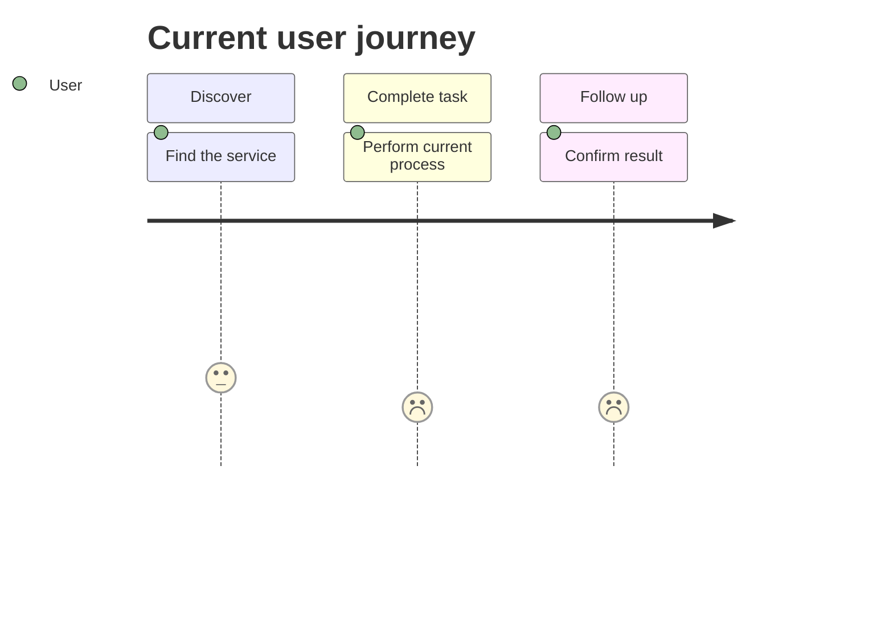
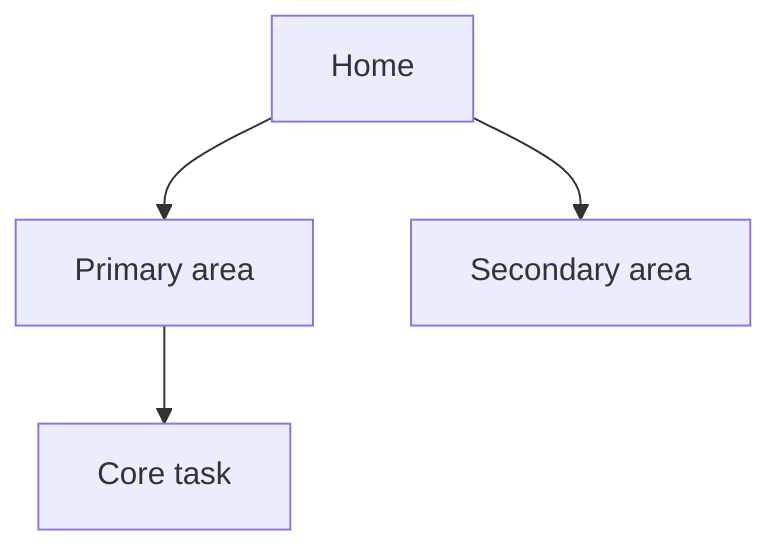
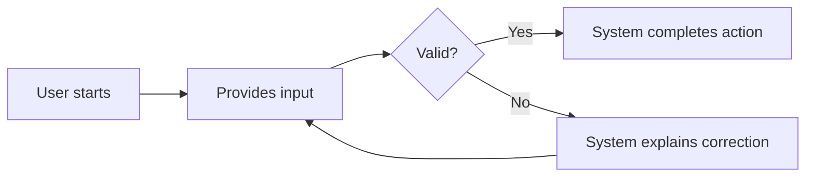
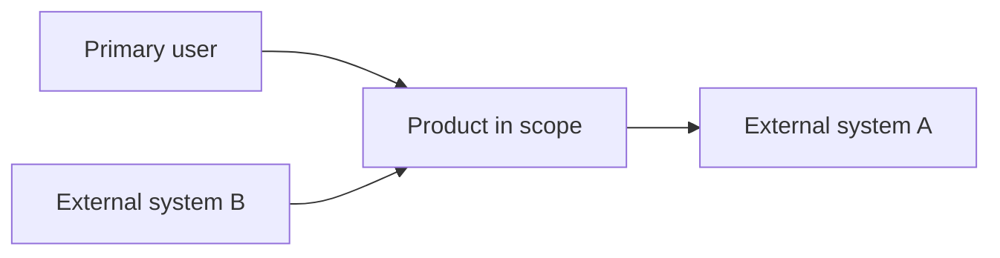
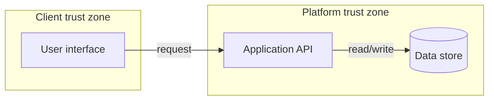
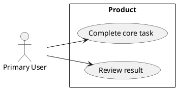

# Product Design Brief Template

> Use this document during discovery and early design. Keep it as a living artifact. Replace all `<placeholder>` text, remove sections that do not apply, and link detailed architecture or feature specifications rather than duplicating them.

## 0. Document Control

| Field | Value |
|---|---|
| Product / project | `<name>` |
| Document owner | `<name and role>` |
| Contributors | `<names and roles>` |
| Status | `Draft / In review / Approved / Superseded` |
| Version | `<x.y>` |
| Last updated | `<YYYY-MM-DD>` |
| Reviewers / approvers | `<names and roles>` |
| Related artifacts | `<links to roadmap, architecture, feature specs, ADRs>` |

### Revision History

| Version | Date | Author | Change | Decision / approval |
|---|---|---|---|---|
| 0.1 | `<date>` | `<author>` | Initial draft | `<status>` |

## 1. Executive Summary

### 1.1 Product Idea

`<Describe the product in 2 to 4 sentences: who it serves, the problem it solves, and the intended value.>`

### 1.2 One-Line Value Proposition

**For** `<target user>` **who** `<need or problem>`, **the** `<product>` **is a** `<category>` **that** `<primary benefit>`. **Unlike** `<alternative>`, **it** `<key differentiator>`.

### 1.3 Desired Outcomes

| Outcome ID | Outcome | Baseline | Target | Measurement method | Review date |
|---|---|---:|---:|---|---|
| OUT-001 | `<user or business outcome>` | `<value>` | `<value>` | `<analytics, survey, operational measure>` | `<date>` |

### 1.4 Current Status and Recommendation

- **Current stage:** `<idea / discovery / validation / ready for architecture>`
- **Recommendation:** `<proceed / validate / pause / stop>`
- **Reasoning:** `<brief evidence-based rationale>`

## 2. Problem and Opportunity

### 2.1 Problem Statement

`<Who experiences the problem, what happens, in which context, and why it matters. Avoid embedding a preferred solution.>`

### 2.2 Evidence

| Evidence ID | Source | Observation | Confidence | Implication |
|---|---|---|---|---|
| EVD-001 | `<interview, analytics, research, support ticket>` | `<finding>` | `Low / Medium / High` | `<what it suggests>` |

### 2.3 Existing Journey and Pain Points

| Journey step | User goal | Current action | Pain point | Opportunity |
|---|---|---|---|---|
| `<step>` | `<goal>` | `<action>` | `<pain>` | `<opportunity>` |

### 2.4 Alternatives and Competitors

| Alternative | How users solve it today | Strengths | Weaknesses | Differentiation opportunity |
|---|---|---|---|---|
| `<manual process / product / do nothing>` | `<description>` | `<strengths>` | `<weaknesses>` | `<opportunity>` |

## 3. Vision, Scope, and Principles

### 3.1 Product Vision

`<Describe the future state if the product succeeds.>`

### 3.2 Goals

- G-001: `<specific outcome the project intends to achieve>`
- G-002: `<specific outcome>`

### 3.3 Non-Goals

- NG-001: `<explicitly excluded outcome or capability>`
- NG-002: `<explicitly excluded item>`

### 3.4 Scope

| In scope | Out of scope | Possible later |
|---|---|---|
| `<capability>` | `<excluded capability>` | `<future option>` |

### 3.5 Product and Design Principles

1. `<principle and why it matters>`
2. `<principle and why it matters>`
3. `<principle and why it matters>`

## 4. Users and Stakeholders

### 4.1 Stakeholder Map

| Stakeholder / role | Interest | Influence | Needed decision or input | Engagement approach |
|---|---|---|---|---|
| `<role>` | `<interest>` | `Low / Medium / High` | `<input>` | `<approach>` |

### 4.2 Persona: `<Persona Name>`

> Personas must be grounded in research. Note whether each statement is observed, inferred, or assumed.

- **Archetype / role:** `<role>`
- **Context:** `<environment, device, workflow, frequency>`
- **Goals:** `<goals>`
- **Behaviors:** `<relevant observed behaviors>`
- **Pain points:** `<pain points>`
- **Motivations:** `<motivations>`
- **Constraints:** `<accessibility, time, policy, skill, connectivity>`
- **Current workaround:** `<how the problem is handled today>`
- **Evidence:** `<research references>`
- **Confidence:** `Low / Medium / High`

### 4.3 Jobs to Be Done

**When** `<situation>`, **I want to** `<motivation or job>`, **so I can** `<expected outcome>`.

### 4.4 Primary Use Cases

| Use Case ID | Actor | Trigger | Preconditions | Main outcome | Priority |
|---|---|---|---|---|---|
| UC-001 | `<actor>` | `<trigger>` | `<preconditions>` | `<outcome>` | `Must / Should / Could / Won't now` |

## 5. Assumptions, Hypotheses, and Validation

| ID | Assumption / hypothesis | Risk if false | Validation method | Success threshold | Owner | Status |
|---|---|---|---|---|---|---|
| HYP-001 | `<belief>` | `<impact>` | `<interview, experiment, prototype, spike>` | `<observable threshold>` | `<owner>` | `Open / Validated / Invalidated` |

## 6. Functional Requirements

Write requirements as singular, necessary, implementation-neutral statements. Give each requirement a stable identifier and a verification method.

| ID | Requirement | Rationale / source | Priority | Verification | Related use case | Status |
|---|---|---|---|---|---|---|
| FR-001 | The system shall `<observable capability>`. | `<source>` | `Must / Should / Could` | `<test, inspection, analysis, demo>` | `UC-001` | `Proposed / Approved / Implemented / Verified` |

### 6.1 Business Rules

| ID | Rule | Example | Exceptions | Owner |
|---|---|---|---|---|
| BR-001 | `<rule>` | `<example>` | `<exceptions>` | `<business owner>` |

### 6.2 Data Requirements

| ID | Data object | Source | Classification | Retention | Quality rules | Owner |
|---|---|---|---|---|---|---|
| DATA-001 | `<object>` | `<source>` | `<public / internal / confidential / restricted>` | `<period or policy reference>` | `<validation rules>` | `<owner>` |

## 7. Non-Functional and Quality Requirements

Use measurable quality scenarios where possible. Replace words such as "fast," "secure," and "scalable" with testable thresholds.

| ID | Quality attribute | Scenario / requirement | Measure and target | Operating conditions | Verification | Priority |
|---|---|---|---|---|---|---|
| NFR-001 | Performance | When `<stimulus>`, the system shall `<response>`. | `<metric and threshold>` | `<normal / peak / degraded>` | `<load test>` | `<priority>` |
| NFR-002 | Availability | `<requirement>` | `<SLO / recovery target>` | `<conditions>` | `<monitoring / exercise>` | `<priority>` |
| NFR-003 | Security | `<requirement>` | `<control or verification target>` | `<threat context>` | `<security test>` | `<priority>` |
| NFR-004 | Accessibility | `<requirement>` | `<WCAG 2.2 conformance target>` | `<supported experiences>` | `<automated and manual audit>` | `<priority>` |
| NFR-005 | Privacy | `<requirement>` | `<data minimization / retention / consent target>` | `<jurisdiction / policy>` | `<review / test>` | `<priority>` |
| NFR-006 | Reliability | `<requirement>` | `<error rate / recovery target>` | `<conditions>` | `<resilience test>` | `<priority>` |
| NFR-007 | Observability | `<requirement>` | `<logs, metrics, traces, alert target>` | `<environment>` | `<operational test>` | `<priority>` |
| NFR-008 | Maintainability | `<requirement>` | `<quality gate / change metric>` | `<codebase context>` | `<pipeline evidence>` | `<priority>` |
| NFR-009 | Compatibility | `<requirement>` | `<browser, device, API version target>` | `<support matrix>` | `<compatibility test>` | `<priority>` |
| NFR-010 | Cost / sustainability | `<requirement>` | `<budget or utilization target>` | `<anticipated load>` | `<cost review>` | `<priority>` |

## 8. Experience and Interaction Design

### 8.1 Experience Principles

- `<principle>`
- `<principle>`

### 8.2 Information Architecture

### 8.3 Happy Path

### 8.4 UX States Checklist

- [ ] First use / onboarding
- [ ] Empty state
- [ ] Loading state
- [ ] Success state
- [ ] Validation error
- [ ] System error
- [ ] Partial / degraded service
- [ ] Unauthorized / forbidden
- [ ] Offline or interrupted flow, if relevant
- [ ] Keyboard-only and assistive technology flow
- [ ] Responsive layouts
- [ ] Localization and content expansion

### 8.5 Prototype and Research Plan

| Question | Prototype fidelity | Participants | Method | Decision enabled |
|---|---|---|---|---|
| `<question>` | `<low / medium / high>` | `<persona / count>` | `<usability test / interview>` | `<decision>` |

## 9. Initial System Context and Diagrams

### 9.1 System Context

### 9.2 Data Flow / Trust Boundaries

### 9.3 Optional UML Use-Case Skeleton

## 10. Constraints and Dependencies

| ID | Type | Description | Impact | Owner | Treatment |
|---|---|---|---|---|---|
| CON-001 | `Technical / Legal / Organizational / Schedule / Budget` | `<constraint>` | `<impact>` | `<owner>` | `<response>` |
| DEP-001 | `Dependency` | `<dependency>` | `<impact>` | `<owner>` | `<response>` |

## 11. Security, Privacy, Compliance, and Responsible Use

### 11.1 Security Objectives

- Confidentiality: `<objective>`
- Integrity: `<objective>`
- Availability: `<objective>`
- Authentication and authorization: `<objective>`
- Auditability: `<objective>`

### 11.2 Threat and Abuse Cases

| ID | Threat / misuse case | Asset | Threat actor | Impact | Mitigation idea | Validation |
|---|---|---|---|---|---|---|
| THR-001 | `<threat>` | `<asset>` | `<actor>` | `<impact>` | `<mitigation>` | `<test / review>` |

### 11.3 Privacy Questions

- What personal or sensitive data is collected, generated, inferred, or shared?
- What is the lawful or organizational purpose for each data element?
- Can the product function with less data?
- Who can access the data and how is access reviewed?
- What are retention, deletion, export, and correction requirements?
- Are automated decisions explainable and contestable where required?

### 11.4 Compliance References

| Requirement / policy | Applicability | Evidence needed | Owner |
|---|---|---|---|
| `<law, regulation, contract, internal policy>` | `<why applicable>` | `<evidence>` | `<owner>` |

## 12. Delivery Strategy

### 12.1 Minimum Viable Product

| MVP capability | User value | Evidence it is needed | Acceptance signal |
|---|---|---|---|
| `<capability>` | `<value>` | `<evidence>` | `<signal>` |

### 12.2 Phased Scope

- **MVP:** `<minimum coherent product>`
- **Next:** `<validated enhancements>`
- **Later:** `<options, not commitments>`

### 12.3 Build, Buy, Reuse, or Retire

| Capability | Option | Decision factors | Recommendation |
|---|---|---|---|
| `<capability>` | `Build / Buy / Reuse / Retire` | `<cost, time, risk, differentiation>` | `<recommendation>` |

## 13. Risks and Open Questions

### 13.1 Risk Register

| ID | Risk | Likelihood | Impact | Mitigation | Trigger | Owner |
|---|---|---|---|---|---|---|
| RSK-001 | `<risk>` | `Low / Medium / High` | `Low / Medium / High` | `<mitigation>` | `<indicator>` | `<owner>` |

### 13.2 Open Questions

| ID | Question | Why it matters | Owner | Due / decision point | Status |
|---|---|---|---|---|---|
| OQ-001 | `<question>` | `<impact>` | `<owner>` | `<date / milestone>` | `Open / Resolved` |

## 14. Traceability

| Goal | Persona / job | Use case | Requirement | Feature | Validation / metric |
|---|---|---|---|---|---|
| `G-001` | `<persona>` | `UC-001` | `FR-001, NFR-001` | `<feature ID>` | `<test / outcome>` |

## 15. Readiness Checklist

- [ ] Problem and target users are supported by evidence.
- [ ] Goals, non-goals, scope, and MVP are explicit.
- [ ] Personas distinguish evidence from assumptions.
- [ ] Functional requirements are uniquely identified and verifiable.
- [ ] Quality requirements contain measurable targets.
- [ ] Accessibility, privacy, security, and abuse cases were considered.
- [ ] Dependencies, constraints, risks, and open questions have owners.
- [ ] Initial diagrams define the system boundary and major flows.
- [ ] Outcomes and measurement methods are defined.
- [ ] Stakeholders reviewed the brief and significant decisions are recorded.

## 16. References

### Standards and primary guidance

- ISO/IEC/IEEE 29148:2018, requirements engineering processes, information items, required content, and formatting guidance: https://www.iso.org/standard/72089.html
- W3C Web Content Accessibility Guidelines 2.2, testable accessibility success criteria: https://www.w3.org/TR/WCAG22/
- NIST SP 800-218, Secure Software Development Framework 1.1: https://csrc.nist.gov/pubs/sp/800/218/final
- OWASP Application Security Verification Standard: https://owasp.org/www-project-application-security-verification-standard
- C4 model, system context and architecture diagram hierarchy: https://c4model.com/
- Mermaid diagram syntax: https://mermaid.ai/open-source/intro/syntax-reference.html
- PlantUML documentation: https://plantuml.com/

### Tailoring note

This template is an original synthesis. It is informed by the references above, but it is not an official reproduction of any standard and does not by itself establish compliance.