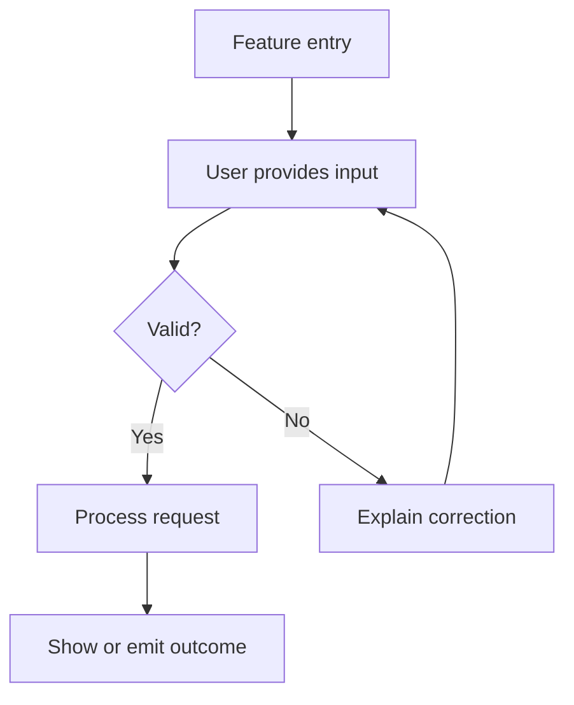
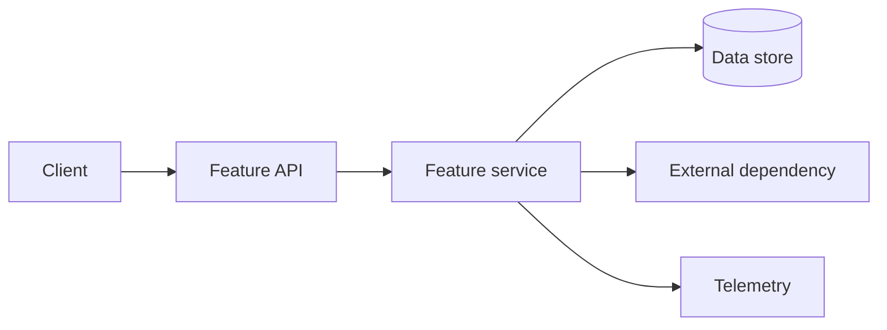
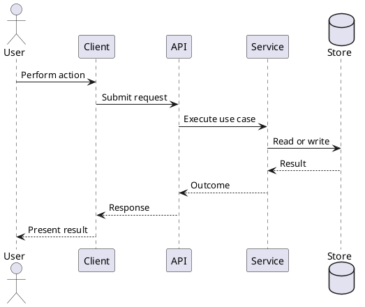
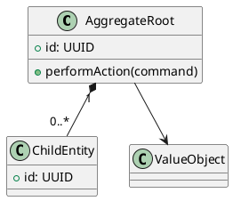
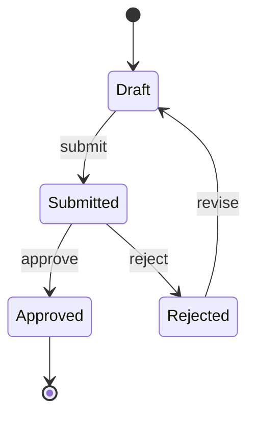

# Feature Specification Template

> Use one file per meaningful feature. The specification should be small enough to review and detailed enough for product, engineering, design, security, and testing to reach the same interpretation. Requirements and acceptance criteria should describe observable behavior, not hidden implementation, unless the implementation constraint is itself required.

## 0. Document Control

| Field | Value |
|---|---|
| Feature ID | `<FEAT-XXX>` |
| Feature name | `<name>` |
| Product / system | `<name>` |
| Owner | `<product owner / analyst>` |
| Engineering owner | `<name / team>` |
| Design owner | `<name / team>` |
| Status | `Discovery / Draft / Ready / In progress / Released / Deprecated` |
| Version | `<x.y>` |
| Last updated | `<YYYY-MM-DD>` |
| Target release | `<release or milestone, not a promise>` |
| Product brief | `<link>` |
| Architecture | `<link>` |
| Related ADRs | `<links>` |

## 1. Summary

### 1.1 Feature Statement

**As a** `<persona or actor>`, **I want** `<capability>`, **so that** `<outcome>`.

### 1.2 Problem and Evidence

`<Describe the user problem and cite research, analytics, support evidence, or a validated business need.>`

### 1.3 Expected Value

| Value type | Expected outcome | Measurement |
|---|---|---|
| User | `<outcome>` | `<signal>` |
| Business | `<outcome>` | `<metric>` |
| Operational | `<outcome>` | `<metric>` |

### 1.4 Scope

- **In scope:** `<behaviors and surfaces>`
- **Out of scope:** `<explicit exclusions>`
- **Dependencies:** `<systems, teams, policies, prerequisite features>`
- **Assumptions:** `<assumptions that need validation>`

## 2. Actors, Permissions, and Preconditions

| Actor / role | Goal | Required permission | Preconditions | Data access |
|---|---|---|---|---|
| `<actor>` | `<goal>` | `<permission>` | `<precondition>` | `<scope>` |

## 3. User Experience

### 3.1 Entry Points

- `<navigation, deep link, API call, event, scheduled trigger>`

### 3.2 Main User Flow



## 4. Functional Behavior

### 4.3 Input Rules

| Input | Type / format | Required | Validation | Default | Sensitive? | Error message |
|---|---|---|---|---|---|---|
| `<field>` | `<type>` | `Yes / No` | `<rules>` | `<default>` | `Yes / No` | `<message>` |

### 4.4 Output Rules

| Output | Format | Audience / consumer | Data source | Ordering / paging | Empty behavior |
|---|---|---|---|---|---|
| `<output>` | `<format>` | `<consumer>` | `<source>` | `<rules>` | `<behavior>` |

## 5. Acceptance Criteria

Use concrete, independently testable scenarios. Include happy paths, boundaries, errors, permissions, concurrency, and recovery where relevant.

### 5.1 Gherkin Scenarios

```gherkin
Feature: <Feature name>
  <Short description and important business rules>

  Background:
    Given <shared context only when it applies to every scenario>

  Rule: <Business rule>

    Scenario: <Happy path with a specific outcome>
      Given <initial state>
      And <additional context>
      When <single meaningful action>
      Then <observable outcome>
      And <additional observable outcome>

    Scenario: <Validation or boundary behavior>
      Given <initial state>
      When <action with invalid or boundary input>
      Then <specific safe response>
      And <state that must not change>

    Scenario Outline: <Data-driven behavior>
      Given <context using <parameter>>
      When <action using <parameter>>
      Then <expected <result>>

      Examples:
        | parameter | result |
        | <value>   | <value> |
```

## 6. Non-Functional Requirements

| ID | Attribute | Requirement / scenario | Measure and target | Conditions | Verification |
|---|---|---|---|---|---|
| NFR-001 | Performance | `<response behavior>` | `<latency / throughput target>` | `<load profile>` | `<test>` |
| NFR-002 | Reliability | `<behavior>` | `<error / recovery target>` | `<conditions>` | `<test>` |
| NFR-003 | Security | `<control or behavior>` | `<verification target>` | `<threat context>` | `<test / review>` |
| NFR-004 | Privacy | `<data behavior>` | `<minimization / retention target>` | `<context>` | `<review / test>` |
| NFR-005 | Accessibility | `<behavior>` | `<WCAG criterion / conformance target>` | `<surface>` | `<manual and automated test>` |
| NFR-006 | Observability | `<events / signals>` | `<coverage / alert target>` | `<environment>` | `<operational test>` |
| NFR-007 | Compatibility | `<supported clients / versions>` | `<support matrix>` | `<conditions>` | `<compatibility test>` |

## 7. Technical Design

### 7.1 Technical Summary

`<Describe the implementation approach at the level necessary for review. Link to an ADR for significant choices.>`

### 7.2 Block Diagram



### 7.3 Sequence Diagram



### 7.4 Class / Domain Model



### 7.5 State Model



### 7.6 Data Changes

| Entity / table | Change | Field | Type | Nullability | Default | Migration / backfill | Retention impact |
|---|---|---|---|---|---|---|---|
| `<entity>` | `Add / Modify / Remove` | `<field>` | `<type>` | `<rule>` | `<default>` | `<plan>` | `<impact>` |

### 7.7 API Contract

| Operation | Method / event | Path / topic | Authorization | Request schema | Response / event | Errors | Idempotency |
|---|---|---|---|---|---|---|---|
| `<operation>` | `<method>` | `<path>` | `<policy>` | `<link>` | `<link>` | `<codes>` | `<key / behavior>` |

Example skeleton:

```yaml
openapi: 3.1.0
info:
  title: <Feature API>
  version: 0.1.0
paths:
  /resources:
    post:
      operationId: createResource
      responses:
        '201':
          description: Created
        '400':
          description: Invalid request
        '401':
          description: Unauthenticated
        '403':
          description: Forbidden
        '409':
          description: Conflict
```

### 7.8 Events and Messaging

| Event | Producer | Consumer | Trigger | Schema | Delivery semantics | Ordering | Retry / dead letter |
|---|---|---|---|---|---|---|---|
| `<event>` | `<producer>` | `<consumer>` | `<trigger>` | `<link>` | `<at-least-once, etc.>` | `<guarantee>` | `<policy>` |

### 7.9 Configuration and Feature Flags

| Key / flag | Purpose | Default | Scope | Owner | Removal condition |
|---|---|---|---|---|---|
| `<key>` | `<purpose>` | `<value>` | `<environment / tenant / cohort>` | `<owner>` | `<condition>` |

## 8. Security, Privacy, and Abuse Resistance

### 8.1 Security Requirements

| ID | Risk / requirement | Control | Verification | Reference |
|---|---|---|---|---|
| SEC-001 | `<risk or requirement>` | `<control>` | `<test / review>` | `<OWASP ASVS / policy ID>` |

### 8.2 Authorization Matrix

| Action | Role A | Role B | Service identity | Audit event |
|---|---|---|---|---|
| `<action>` | `Allow / Deny / Conditional` | `<value>` | `<value>` | `<event>` |

### 8.3 Threat and Misuse Cases

| ID | Misuse / threat | Preconditions | Impact | Prevention | Detection | Response |
|---|---|---|---|---|---|---|
| THR-001 | `<threat>` | `<conditions>` | `<impact>` | `<control>` | `<signal>` | `<response>` |

## 9. Observability and Analytics

### 9.1 Product Analytics

| Event | Trigger | Properties | Privacy classification | Success metric |
|---|---|---|---|---|
| `<event>` | `<trigger>` | `<properties>` | `<class>` | `<metric>` |

### 9.2 Operational Telemetry

| Signal | Name | Dimensions | Alert condition | Dashboard / query | Runbook |
|---|---|---|---|---|---|
| Metric | `<name>` | `<dimensions>` | `<condition>` | `<link>` | `<link>` |
| Log | `<event>` | `<fields>` | `<condition>` | `<link>` | `<link>` |
| Trace | `<span>` | `<attributes>` | `<condition>` | `<link>` | `<link>` |

## 10. Failure, Recovery, and Compatibility

| Scenario | Expected behavior | User message | Retry / recovery | Data guarantee | Test |
|---|---|---|---|---|---|
| Dependency unavailable | `<behavior>` | `<safe message>` | `<policy>` | `<guarantee>` | `<test>` |
| Duplicate request | `<behavior>` | `<message>` | `<idempotency behavior>` | `<guarantee>` | `<test>` |
| Partial failure | `<behavior>` | `<message>` | `<compensation>` | `<guarantee>` | `<test>` |

### Backward Compatibility

- API / event compatibility: `<rules>`
- Data migration compatibility: `<rules>`
- Existing client behavior: `<rules>`
- Deprecation plan: `<plan>`

## 11. Test Strategy

| Test level | Scope | Key cases | Environment / data | Automation | Evidence |
|---|---|---|---|---|---|
| Unit | `<scope>` | `<cases>` | `<setup>` | `<yes/no>` | `<link>` |
| Integration | `<scope>` | `<cases>` | `<setup>` | `<yes/no>` | `<link>` |
| Contract | `<scope>` | `<cases>` | `<setup>` | `<yes/no>` | `<link>` |
| End-to-end | `<scope>` | `<cases>` | `<setup>` | `<yes/no>` | `<link>` |
| Accessibility | `<scope>` | `<cases>` | `<assistive tech>` | `<mixed>` | `<link>` |
| Security | `<scope>` | `<cases>` | `<setup>` | `<mixed>` | `<link>` |
| Performance | `<scope>` | `<load model>` | `<setup>` | `<yes/no>` | `<link>` |
| Resilience | `<scope>` | `<faults>` | `<setup>` | `<yes/no>` | `<link>` |

### Test Data

- Data source: `<synthetic / masked / generated>`
- Sensitive-data safeguards: `<controls>`
- Required fixtures: `<fixtures>`
- Cleanup / isolation: `<approach>`

## 12. Rollout and Operations

### 12.1 Rollout Plan

| Stage | Audience / traffic | Entry criteria | Monitoring | Exit / rollback criteria |
|---|---|---|---|---|
| Internal | `<cohort>` | `<criteria>` | `<signals>` | `<criteria>` |
| Limited | `<cohort>` | `<criteria>` | `<signals>` | `<criteria>` |
| General | `<cohort>` | `<criteria>` | `<signals>` | `<criteria>` |

### 12.2 Migration and Backfill

- Migration steps: `<summary or runbook link>`
- Backfill approach: `<approach>`
- Validation: `<checks>`
- Reversibility: `<rollback / forward-fix>`

### 12.3 Support Readiness

- Runbook: `<link>`
- Known errors / troubleshooting: `<link>`
- Support owner: `<team>`
- Alerts: `<links>`
- User communication: `<plan>`

## 13. Dependencies, Risks, and Open Questions

### Dependencies

| ID | Dependency | Needed by | Owner | Failure impact | Contingency |
|---|---|---|---|---|---|
| DEP-001 | `<dependency>` | `<milestone>` | `<owner>` | `<impact>` | `<contingency>` |

### Risks

| ID | Risk | Likelihood | Impact | Mitigation | Trigger | Owner |
|---|---|---|---|---|---|---|
| RSK-001 | `<risk>` | `<rating>` | `<rating>` | `<mitigation>` | `<trigger>` | `<owner>` |

### Open Questions

| ID | Question | Decision owner | Needed by | Status / resolution |
|---|---|---|---|---|
| OQ-001 | `<question>` | `<owner>` | `<milestone>` | `Open / Resolved: <answer>` |

## 14. Traceability

| Product goal | Feature requirement | Acceptance scenario | Design element | Test | Telemetry |
|---|---|---|---|---|---|
| `<goal ID>` | `<FR/NFR/SEC ID>` | `<scenario>` | `<component / API / state>` | `<test ID>` | `<event / metric>` |

## 15. Definition of Ready

- [ ] Problem, evidence, value, scope, and exclusions are clear.
- [ ] Actors, permissions, preconditions, and business rules are defined.
- [ ] UX flow and all relevant states are covered.
- [ ] Functional and non-functional requirements are testable.
- [ ] Acceptance scenarios include happy, alternate, error, and boundary cases.
- [ ] API, data, event, state, and deployment impacts are understood.
- [ ] Security, privacy, accessibility, observability, and compatibility were reviewed.
- [ ] Dependencies, risks, assumptions, and open questions have owners.
- [ ] Rollout, rollback, migration, and support needs are defined.
- [ ] Traceability from goal to telemetry is present.

## 16. Definition of Done

- [ ] All must-have acceptance scenarios pass.
- [ ] Required automated and manual tests pass.
- [ ] Security and accessibility verification evidence is attached.
- [ ] Telemetry, dashboards, alerts, and runbooks are operational.
- [ ] Data migration and rollback were validated where applicable.
- [ ] Documentation, API contracts, and diagrams reflect the released behavior.
- [ ] Feature flags have an owner and removal condition.
- [ ] Known limitations and residual risks are recorded.
- [ ] Product owner and required reviewers accepted the evidence.

## 17. References

### Primary references

- ISO/IEC/IEEE 29148:2018, requirements engineering and requirement information items: https://www.iso.org/standard/72089.html
- Cucumber Gherkin reference, executable specification keywords and structure: https://cucumber.io/docs/gherkin/reference/
- C4 model, architecture diagram hierarchy: https://c4model.com/
- OWASP Application Security Verification Standard: https://owasp.org/www-project-application-security-verification-standard
- NIST SP 800-218, Secure Software Development Framework 1.1: https://csrc.nist.gov/pubs/sp/800/218/final
- W3C Web Content Accessibility Guidelines 2.2: https://www.w3.org/TR/WCAG22/
- Mermaid diagram syntax: https://mermaid.ai/open-source/intro/syntax-reference.html
- PlantUML documentation: https://plantuml.com/

### Tailoring note

This template is an original synthesis. It uses the cited references as authoritative anchors for requirements, acceptance criteria, architecture communication, secure development, accessibility, and diagrams as code. It is not itself a compliance standard.